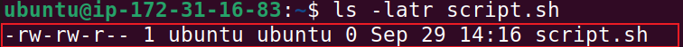

# advanced-linux-commands

## File permissions and Access Rights

Understanding file permissions and ownership in Linux is important because it lets you control who can access or change files and folders, helping keep your system secure. 

Now let’s look at some key commands and concepts you need to know

## Numeric Representation of Permissions

In Linux, permissions are shown with numbers. Each type of permission—**no permission, read, write, and execute**—has a numeric value: 
- **no permission = 0**, 
- **read = 4**, 
- **write = 2**, 
- **execute = 1**.

These values are combined to represent the permissions for each user class. Let's consider a few examples.

**Permissions Represented by 7**

4 (read) + 2 (write) + 1 (execute) = 7
Symbolic: rwx
Meaning: Read, write, and execute permissions are all granted.
Example Context: A script file that the owner needs to read, modify, and execute.

**Permissions Represented by 5**

4 (read) + 1 (execute) = 5
Symbolic: r-x
Meaning: Read and execute permissions are granted, but write permission is not.
Example Context: A shared library or a command tool that users can execute and read but not modify.

**Permissions Represented by 6**

4 (read) + 2 (write) = 6
Symbolic: rw-
Meaning: Read and write permissions are granted, but execute permission is not.
Example Context: A text file that the owner can read and edit, but not run as a program.

## Shorthand Representation of Permissions

In addition to the numeric method of displaying permissions, Linux also employs a shorthand or symbolic approach to represent file permissions.

## Understanding User Classes from a Permissions Perspective.

Before exploring shorthand permissions, it’s essential to grasp the concept of "user classes" in the context of Linux permissions. These user classes are categories that Linux recognizes when determining who can perform specific actions on a file. There are three primary classes:
- **Owner**: The individual who created the file, often referred to as the "user."
- **Group**: A collection of users who share certain permissions for the file.
- **Others**: Anyone else with access to the computer who doesn’t fall into the first two categories.

## The Role of Hyphens (-) in Permission Representation

When discussing permissions, you might notice hyphens (-) being mentioned. In the context of Linux file permissions, a hyphen doesn’t represent a user class. Instead, it is used in the symbolic representation of permissions to indicate the absence of a permission.

Let’s explore some practical examples. Open your Linux terminal and execute the command **ls -ltr**

Let’s break it down to understand each part:

- In the output shown above, the first character can either be a “-” or a “d”, “d” indicates a directory while “-” indicates a regular file.

- The next three characters (rwx) display the owner’s permissions — r for read, w for write, and x for execute.

- If a permission isn’t given, a “-” appears in its place, (e.g., r-x means the read and execute permissions are allowed, but write is not.)

- The hyphen (-) separates the permissions for owner, group, and others.

- The next three characters after the owner’s permissions show the group’s permissions, following the same r, w, and x pattern.

- The last three characters show the permissions for others.

The order the user class is represented is as follows;

- The first hyphen **"-"** is the **user**

- The second hyphen **"-"** is the **group**

- The third hyphen **"-"** is **others**

## File Permission Commands

To manage file ownership and permissions in Linux, several commands are available.

## chmod Command
The chmod command is used to change file permissions. It allows you to use either symbolic or numeric values to assign permissions for the user, group, and others.

Let’s look at an example:
You can create an empty file using the 'touch' command

Check the permission of the file

**What do you think the permission of the above output represent?**

 - (4 + 2) = 6 for the user (read and write)

- (4 + 2) = 6 for the group (read and write)

- (4) = 4 for others (read only)

Now lets update the permission so that all the user classes will have execute permission

The above command uses the chmod command with the +x option to grant execute to the file script.sh, which adds the execute permission to the existing permissions for all the user classes.

So lets check what the file permission look like

The same command can be executed to achieve the same result using the numbers approach.

To give execute permission to all (user, group, and others), you need to add 1 to each of the three permission categories. This results in a numeric value of 755:

- (4 + 2 + 1) = 7 for the user (read, write, and execute)

- (4 + 1) = 5 for the group (read and execute)

- (4 + 1) = 5 for others (read and execute)

Now, let’s look at another example. Suppose the owner of a file currently has full permission to **note.txt**.

If you want to allow both the group and others to read, write, and execute the file, change its permission type to -rwxrwxrwx, which has a numeric value of 777.

Check the output

Notice the dash ('-') in the first position represent the file type and not a user class. It indicates that the entry is a regular file.

## Chown Command

It's allows you to change the ownership of files, directories, or symbolic links to a specified username or group.

The basic format is as follow; **chown [option] owner[:group] file(s)**

For instance, lets assume there is a user on the sever called "**john**", a group on the server called "**developers**" and you want the owner of '**filename.txt**' changed from "**ubuntu**" to "**john**" and to also ensure that any user in the developers group has the ownership of the file as well:

The command would look like below;

As you can see from the above output that read 'Operation not permitted', so what I did was that I became a superuser to execute the task by simply type **sudo** as already taught before the chown command was invoked again and the new result was shown below;

Check the output with ls -latr command on this file to then see the new changes.

## Superuser Privileges

In Linux, some important tasks need special permission called superuser or root access. However, it’s not safe to stay logged in as the root user all the time.
To perform such tasks safely, Linux provides a tool called sudo (which means “super user do”). It lets you run specific commands with temporary root permission.
You just need to type **'sudo'** before the command you want to run with admin rights.

If you want to fully switch to the root user, simply run: **'sudo -i'**

## User Management on Linux

As a DevOps engineer, you'll often handle systems administration tasks, such as managing various users on servers. It's essential to understand how to add new users or groups, adjust their permissions, change passwords, and perform related activities.

## Creating a New User
To add a new user on an Ubuntu server, use the adduser command. For example, if the username is "john," open your terminal and execute the command below; '**sudo adduser john'**

so when you run the adduser john command in the terminal, it won't just create the user right away—it'll guide you through a simple setup process with a few questions. Think of it like filling out a quick form.
Set a Password: First, it'll ask you to type a secure password for the new user (like "john"). You'll enter it twice to make sure you typed it correctly. Remember, passwords keep things safe, so pick something strong!
Add Extra Details: Next, it might ask for optional info, such as the user's full name (e.g., "John Smith") or contact details like an email or phone number. These help identify the user but aren't always required—you can just hit Enter to skip them if you're in a hurry.
Once you've answered everything, the system will finish up by creating the user account and automatically making a personal folder (called the home directory) for John. 

The home directories
A home directory is basically a private space on the server where the user can store their files, settings, and personal data—like a "My Documents" folder on your computer. For our example user "john," it would be created at **/home/john**.

Granting Administrative Privileges

Initially, the newly created user accounts do not have administrative privileges. To grants administrative access to a user, you can add the user to the sudo. Users in the sudo group can run commands with administrative privileges. To the **john** user to the sudo group, run

- **usermod**: This is a command that modifies user account properties.

- -aG: These are flags used with the usermod command.

    - • -a stands for "append" and is used to add the user to the specified group(s) without removing them from other groups they may already belong to.

    - • -G stands for "supplementary groups" and is followed by a comma-separated list of groups. It specifies the groups to which the user should be added or modified.

- In the given command, '**-aG sudo**' is used to add the user '**john**' to the **sudo** group.

- The sudo group is typically associated with administrative or superuser privileges. By adding '**john**' to the '**sudo**' group, the user gains the ability to execute commands with elevated privileges. 

**Tasks for you:**

- Log out and log back in as the newly created user
- Navigate to the /home/john directory to explore what has been created.
    Tip: Use the cd command.

    **Solution**

## Switching User Accounts

To start using the system as another user, you will need to use the '**su**' command to switch.

To switch to another user account, use the '**su**' command followed by the username. For example, to switch to the john account, run **su john**;
then type the user password and click enter key to switch to the user's environment.

## Modifying User Accounts

**Changing User Password**

To change the password for a user, use the '**passwd**' followed by the username. For instance, to change the password for **john**, run: **sudo passwd john**

You will be prompted to enter and confirm the new password for the user.

**Tasks for you:**

- Test the updated password by logging on to the server, using the newly updated password.

**Solution to password modification task 2:**

## Creating a Group

To create a  new group, use the '**groupadd**' command. For example, to create a group name "developers," use:

## Adding Users to the Group

Use the '**usermod**' command to add users to the group. For example, to add users "john" and "jane" to the "developers" group, run **sudo usermod -aG developers john**:

The '**-aG**' append the "developers" to the users' existing group memberships.

**Verifying Group Membership**

To confirm the group memnerships for a specific user, use '**id**' command. For example, to check the group memberships for the user "john", run **id** john:

## Deleting a User

To delete a user, run the following command: "**sudo userdel username**"

## Ensuring Proper Group Permissions

Groups in Linux are often used to manage permissions for files and directories. Ensure that the relevant files or directories have the appropriate group ownership and permissions. For instance, to grant the 'developers' group ownership of a directory, run: "**sudo chown :developers /path/to/directory**"

And to grant read and write permissions to the group, run: "**sudo chmod g+rw /path/to/directory**"

## 🏃‍♀️ **Side Hustle Task 3**

- Create a group on the server and name it **'devops'**

- Create 5 users [**'Mary'**, **'Mohammed'**, **'Ravi'**, **'Tunji'**, **'Sofia'**], and ensure each user belongs to the devops group

- Create a folder for each user in the **'/home'** directory. For example **'/home/mary'**

- Ensure that the group ownership of each created folder belongs to **'devops'**

## **Solutions to the Tasks 3**:

A 'devops' group was created along with five new users. Each user was added to the 'devops' group and given an individual home directory, with all the directories set so that their group ownership belongs to 'devops'

1. User Mary was created

Shown Mary home directory with group ownership permission, and how it's belong to the 'devops' group 

2. User Mohammed was created

Shown Mohammed home directory with group ownership permission, and how it's belong to the 'devops' group

3. User Ravi was created

Shown Ravi home directory with group ownership permission, and how it's belong to the 'devops' group

4. User Tunji created

Shown Tunji home directory with group ownership permission, and how it's belong to the 'devops' group

5. User Sofia was created

Shown Sofia home directory with group ownership permission, and how it's belong to the 'devops' group

